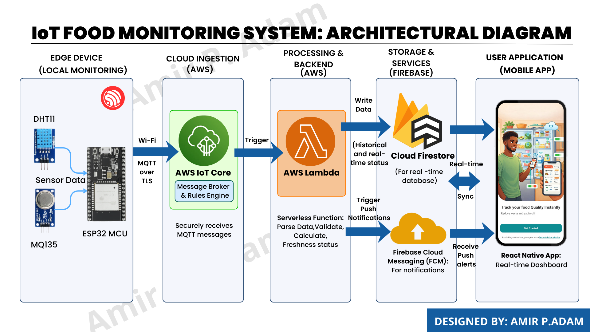
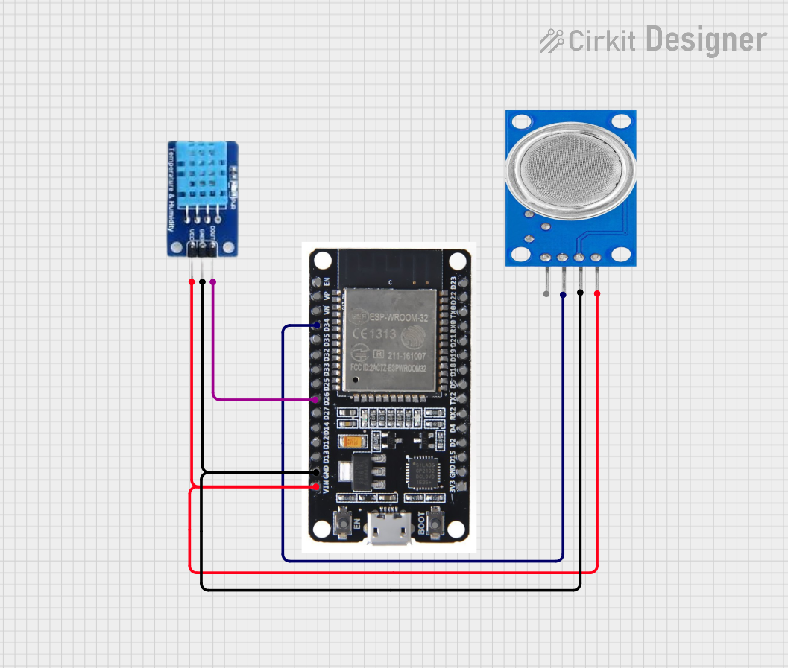
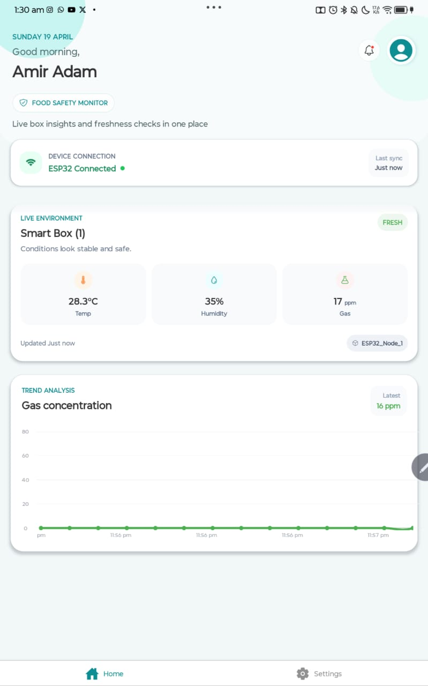

# FreshGuard

FreshGuard is an end-to-end food freshness monitoring system built around an ESP32 smart food box, an AWS IoT ingestion pipeline, Firebase storage, and an Expo mobile app.

The project lets a user pair a hardware device to their account, monitor live sensor readings, review recent history, and receive alerts when food conditions become unsafe.

## How It Works

1. The ESP32 reads temperature, humidity, and gas data from the food box.
2. The device publishes readings to AWS IoT Core over MQTT.
3. An AWS Lambda function validates the payload and writes the latest state plus history into Firestore.
4. The mobile app listens to Firestore in real time and shows status, charts, and pairing state.
5. When thresholds are exceeded, the system can send push alerts to the linked user.

## Architecture

```

```

## Repository Structure

```text
docs/
  images/          Architecture diagrams, circuit diagrams, screenshots
backend/
  Firmware/        ESP32 firmware (PlatformIO + Arduino)
  Lambda/          AWS Lambda that processes IoT payloads
mobile/            Expo React Native app
README.md          Project overview and setup
```

## Key Features

- Email/password authentication with Firebase Auth
- Onboarding flow with in-app terms and privacy modal
- Device pairing by QR code or manual device ID entry
- Real-time dashboard for temperature, humidity, gas, and freshness state
- Historical readings chart from Firestore
- Push notification registration using FCM tokens
- Local in-app fallback alerts while the app is open
- Device unpair flow from settings

## Tech Stack

### Mobile

- Expo SDK 55
- React Native
- Expo Router
- TypeScript
- Firebase Auth
- Cloud Firestore
- Expo Notifications
- Expo Camera

### Cloud

- AWS IoT Core
- AWS Lambda (Node.js)
- Firebase Admin SDK
- Firebase Cloud Messaging

### Hardware

- ESP32
- DHT11 temperature/humidity sensor
- MQ135 gas sensor
- PlatformIO

## Project Visuals

The project diagrams and current result screenshot are included below.

### Architecture Diagram


### Circuit Diagram



### Result



If you want to add more visuals later, place them in `docs/images/` and reference them directly in Markdown so GitHub renders them inline.

## Project Setup

### Prerequisites

- Node.js 20+ and npm
- Android Studio emulator or a physical Android device
- A Firebase project with Authentication and Firestore enabled
- An AWS IoT Core setup for the ESP32 device
- PlatformIO for firmware development

## Mobile App Setup

The mobile app lives in [`mobile`](./mobile).

1. Install dependencies:

```bash
cd mobile
npm install
```

2. Create the local env file:

```bash
cp .env.example .env
```

3. Fill in the Firebase client values in `.env`:

```bash
EXPO_PUBLIC_FIREBASE_API_KEY=
EXPO_PUBLIC_FIREBASE_AUTH_DOMAIN=
EXPO_PUBLIC_FIREBASE_PROJECT_ID=
EXPO_PUBLIC_FIREBASE_STORAGE_BUCKET=
EXPO_PUBLIC_FIREBASE_MESSAGING_SENDER_ID=
EXPO_PUBLIC_FIREBASE_APP_ID=
```

4. Add `google-services.json` to the `mobile` directory for Android builds.

5. Start the app:

```bash
npm run start
```

Useful commands:

```bash
npm run android
npm run web
npm run lint
npm run typecheck
npm run doctor
```

### Firebase Rules and Indexes

The mobile app ships with Firestore config files in [`mobile`](./mobile):

- `firestore.rules`
- `firestore.indexes.json`
- `firebase.json`

Deploy them with:

```bash
cd mobile
npm run firebase:deploy
```

## Lambda Setup

The ingestion function lives in [`backend/Lambda`](./backend/Lambda).

1. Install dependencies:

```bash
cd backend/Lambda
npm install
```

2. Copy the example service account file and fill in your real Firebase Admin credentials:

```text
backend/Lambda/serviceAccountKey.example.json
    ->
backend/Lambda/serviceAccountKey.json
```

3. Provide the real Firebase Admin service account file at:

```text
backend/Lambda/serviceAccountKey.json
```

4. Deploy `index.js` as your AWS Lambda handler.

The function expects payloads shaped like:

```json
{
  "device_id": "ESP32_Node_1",
  "temperature": 24.5,
  "humidity": 68,
  "gas": 42
}
```

What the Lambda does:

- validates the incoming payload
- updates the latest device state in `devices/{device_id}`
- appends a history record in `food_sensor_data`
- sends an FCM push notification when spoilage thresholds are exceeded

## Firmware Setup

The ESP32 firmware lives in [`backend/Firmware`](./backend/Firmware).

1. Open the folder with PlatformIO.
2. Copy the firmware secrets template:

```text
backend/Firmware/src/secrets.example.h
    ->
backend/Firmware/src/secrets.h
```

3. Configure `backend/Firmware/src/secrets.h` with your:
   - AWS IoT endpoint
   - device certificate
   - private key
   - CA certificate
4. Build and upload the firmware to the ESP32.

Main firmware details:

- Publishes to MQTT topic: `esp32/iot_food_monitor/data`
- Uses a Wi-FiManager captive portal for setup
- Wi-Fi portal name: `FreshGuard Setup`
- Wi-Fi portal password: `freshguard`
- Reads from:
  - DHT11 on pin `4`
  - MQ135 on pin `34`

Typical PlatformIO flow:

```bash
cd backend/Firmware
pio run
pio run --target upload
pio device monitor
```

## Firestore Data Model

The app currently uses three main collections:

- `users`
  - stores app-level user data such as `device_id` and `fcm_token`
- `devices`
  - stores the latest reading for each hardware unit
- `food_sensor_data`
  - stores historical sensor readings for charts and logs

## Freshness Logic

The current gas thresholds in the backend are:

- `Fresh`: gas below `30`
- `Warning`: gas from `30` to `99`
- `Spoiled`: gas `100+`

The app also triggers a local high-temperature alert while active when temperature reaches `35°C` or above.

## Notes

- Android is the main mobile target right now.
- The app treats a device as stale when recent readings stop arriving.
- The repo already contains mobile, firmware, and Lambda code, so this README is the best top-level entry point for the whole system.
- Keep real credentials out of version control when setting up your own deployment.

## Additional Reference

- Mobile-specific notes: [`mobile/README.md`](./mobile/README.md)
